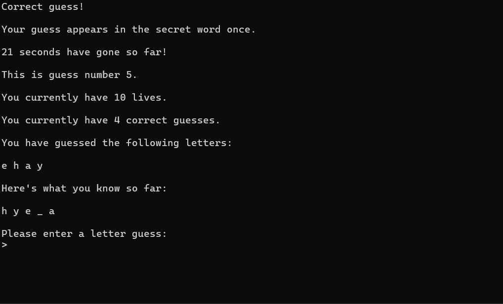

# 🎮 Hangman Suite: A Multi-Interface Python Game


A robust, multi-interface implementation of the classic Hangman game. 

This project was built using **professional software engineering principles**, featuring a decoupled architecture, unit testing using Pytest, and multiple interfaces to run the game engine on.  





---

## ✨ Key Engineering Highlights 
*   **Object-oriented Programming:** Encapsulated game states, such as remaining lives and guessed letters, into manageable and testable objects. 
*   **Decoupled Architecture:** Separated the game engine (`logic.py`) to facilitate development of multiple independent user interfaces. The user selects their mode in `launcher.py`.
*   **Robust Testing:** Features unit tests on the logic using `pytest` with 91% coverage. Used `monkeypatch` to simulate user I/O to test the terminal interface.
*   **Learning Journey:** Included initial function-based version of the game (`hangman_v1_functional/`) to benchmark progress.

> **⚠️ Note on GUI & Web App:** The Desktop GUI and Streamlit Web App are currently included as *Proof of Concepts (Beta)*. Their primary purpose is to demonstrate the extensibility of the decoupled `logic.py` engine.

## 🎮 Game Features
*   **Customisable Difficulty:** Players can choose the length of the secret word and their starting number of lives.
*   **Intelligent Game Tracking:** If a game is won, the engine records the time taken to guess the secret word, the average winning time of all games played by the user, and a bonus message if the game was their quickest winning time yet.
*   **Intelligent Session Tracking:** The engine records the total playing duration, the number of wins in the session, and the % win rate.
*   **Robust Input Handling:** Built-in safeguards to catch typos, duplicate letter guesses, and invalid symbols, prompting the user without crashing the application.

Please read **[`project_writeup.md`](project_writeup.md)** for an in-depth discussion about this project.

---

## 🚀 Getting Started

### 1. Installation
Clone the repository and install the dependencies using your preferred package manager:

**Using Pip:**
```bash
git clone https://github.com/luk3pigg/python-hangman-suite.git
cd python-hangman-suite
pip install -r requirements.txt
```
**Using Conda:**
```bash
git clone https://github.com/luk3pigg/python-hangman-suite.git
cd python-hangman-suite
conda env create -f environment.yml
conda activate hangman-env
```

### 2. Launching the Suite
Run the launcher to access the main menu:
```bash
cd hangman_v2_oop/
python launcher.py
```

From here, you can choose to launch the Classic Terminal Mode, the Desktop GUI, or the Web App.

### 🕰️Exploring function-based version (`hangman_v1_functional/`)
To demonstrate the evolution of this project, the initial version has been preserved. It can be run as follows:
```bash
cd hangman_v1_functional/
python main.py
```
---

## 🧪 Running the Tests
This project uses pytest for unit testing. To run the tests and generate an HTML coverage report:
```bash
pytest --cov=. --cov-report=html
```
Open htmlcov/index.html in your browser to view the interactive coverage breakdown.

---

## 🗺️ Future Roadmap

While the core engine is fully stable, I have several planned features to expand the suite:

* **Live API Integration:** Transitioning from a static local dictionary to an API to provide an larger word bank and real-time definitions.
* **Weighted Scoring System:** Introducing a competitive scoring metric based on word length and lives preserved.
* **Persistent Leaderboards:** Integrating a relational database (SQLite/PostgreSQL) to save player profiles and track historical win rates across multiple sessions.
* **Graphical State Rendering:** Enhancing the GUI and Web interfaces with visual Hangman diagrams that dynamically update based on the core game state.


